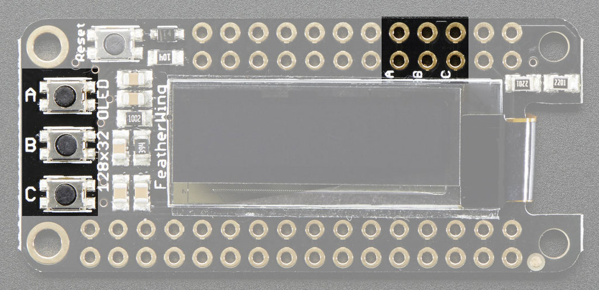

:sectnums:
:toc:
:toclevels: 3

# Adafruit OLED Featherwing 

## Ressources 
- product page :  https://learn.adafruit.com/adafruit-oled-featherwing/overview
- Github repo of the lib : https://github.com/adafruit/Adafruit_SSD1306

## Langage available 

It seem possible to use it with :

- Arduino ([green]#tested#)
- CircuitPython ([red]#not yet tested#)

## Tests 

### First test 

The first test wes really simple : I just try the basic sample delivered with the Featherwing OLED.

include::./Feather_OLED_Test01/Feather_OLED_Test01.ino[]

The code is very basic and all the logic is in the main loop ... not really usefull in the real conditions.

### Using buttons

This featherwing have 4 buttons:

- a reset button
- 3 generic buttons affected to PINs #9 (A), #6 (B) and #15 (C) (at least for the Adafruit MO based on SAMD21).

Now, let's see how we can use interrupts to avoid to have to manage all in the main loop :

include::./Feather_OLED_Test02/Feather_OLED_Test02.ino[]

For memory, the use of Interrupt for case like this work as the following :

- First, all variables used in the ISR (the code called by the interrupt), must be declared as volatile
- Second, declare the ISR with teh following signature: void ISR (void)
- Third, attach the ISR to the correct interrupt and the correct Pin (using attachInterrrupt and digitalPinToInterrupt)

